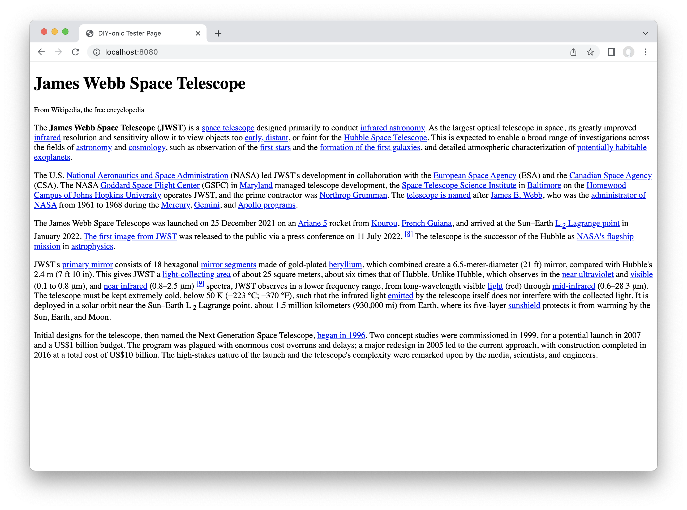

# DIY [Bionic Reading Converter](https://bionic-reading.com) Coding Challenge

_Read this whole document before starting the exercise._

## Introduction

The following challenge seeks to highlight your knowledge of the following:

- JavaScript (particularly ES6 or later)
- HTML/CSS
- DOM manipulation
- CSS selectors
- String processing
- Array iteration
- Identification of edge and corner cases

## Setup

1. Fork this repo https://github.com/friendbuy/diy-onic-converter
2. Clone the repository locally on your computer
3. Install dependencies by invoking `yarn` or `npm install`
4. Start the local web server via `yarn start` or `npm start` (`http://localhost:8080/`)
5. Implement the requested function in _/public/diy-onic-converter.js_ (see below)
6. Test your function by calling it from the console of the test web page (see below)
7. Commit as frequently as needed and push your code accordingly
8. Edit _README.md_ to describe your implementation (see below)
9. If your implementation is sufficiently robust and generalized such that it can be copy-pasted into another web page’s console and invoked from there (see below), please indicate this so that we can try it out

## Tasks

### 1. Learn about “bionic reading”

##### TL;DR
Bionic Reading is a method to help you read faster. This is accomplished by bolding the first part of a word. The idea is your eyes focus on the bolded part of the word and your brain completes the rest.

Test it out [here](https://app.bionic-reading.com/). [^1]

### 2. Implement your own converter function

Write a function that will accept a CSS selector string as an argument—this has been stubbed out in `/public/diy-onic-converter.js`. The function should then convert the content of every `p` element within the elements matched by that selector so that every word is formatted in a style that is similar to bionic reading.

- With the server running (see [Setup](#setup)), test your solution using the provided web page at `http://localhost:8080/`
- The function should be written so that it can be called successfully from a web browser’s developer tools console
- When it finishes execution, the `p` elements within the selected element in the web page should now be formatted similarly to bionic reading
- The function must process the HTML content _locally_—no calling of APIs that do the conversion remotely

> Note that we aren’t giving an exact definition of how bionic reading format is determined (ie. the length of the bolded prefix). A reasonable facsimile will do, even if it does not match the official [bionic reading conversion](https://api.bionic-reading.com/convert/) exactly. See additional [Criteria](#criteria) below.

Example of expected result:
Before                        | After
------------------------------|------------------------------
 | 

### 3. Document your work

Edit _README.md_ so that it describes your function. State what it does, how it does it, and provide instructions on how to use it—the more turnkey, the better!

## Criteria

### Bionic (Basic Requirements)

- Provide Github link to the forked repo
- The function works as specified
  - Invoke function with selector on provided static website
  - Transform all text within `p` tags
- Only needs to support a static prefix length (ie. the number of letters that are bolded)
- The converted HTML and styles sufficiently resemble the conversion performed by https://bionic-reading.com
- _README.md_ provides accurate instructions on how to execute the function

### Bionic Plus (Above and Beyond)

- Please make sure the basic requirements above are working before attempting these bonus features
- The function works when dynamically added to real-world websites (copy-paste into console, invoke function with selector, see results on the current website)[^2]
  - _README.md_ states that this is possible and provides accurate instructions for doing so in addition to a list of sites it was tested on
- The function includes one or more additional capabilities that goes beyond the basic bionic reading conversion. Including, but not limited to:
  - Handles inline HTML tags (``, `<a>`, `<em>`, etc) while maintaining block level tags
  - Preserves links and images
  - Apply to entire page instead of only `p` tags
  - Allows options to be passed to the function to customize the way formatting is performed
- _README.md_ describes the limitations of this implementation (provide sample websites that demonstrate these limitations, if possible)
- Big flex: an in-page user interface that allows the user to convert/toggle the page interactively

---

[^1]: They have a simple online converter that shows you how they transform text into this “bionic” form. Please note, we are asking you to do this solely as an exercise for you to demonstrate your skills, and _not_ to produce a competitor for their core idea and company. We are just using it as a basis for a front-end coding challenge.

[^2]: Please do not attempt to make a browser extension. This is not the purpose of the challenge and we will not install the extension on our browsers to test.
